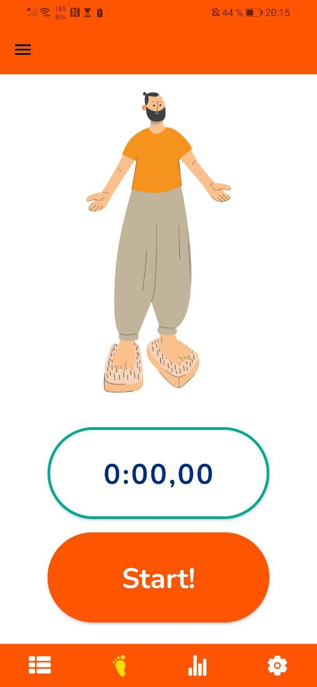
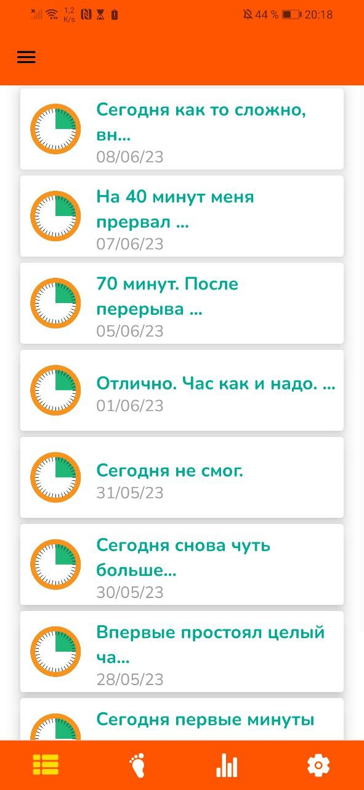
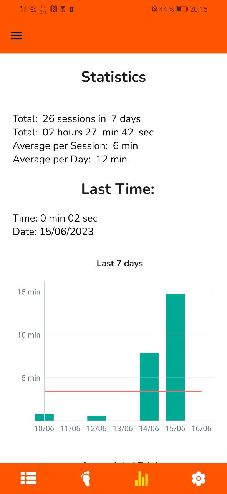

# StepSure App

StepSure is a mobile app designed to help you track and improve your daily activities while promoting mindfulness and well-being. Whether it's tracking your steps, staying active, or reaching your goals, StepSure is here to support you every step of the way.

## Screenshots

Here are some screenshots of the StepSure app:

   
   
   

## Features

- **Activity Tracking:** Keep track of your daily steps and physical activities to stay motivated and achieve your fitness goals.
- **Achievements:** Earn badges and rewards for reaching milestones and staying consistent with your activities.
- **Progress Insights:** Gain insights into your activity patterns and make adjustments for a healthier and more balanced lifestyle.

## Installation

To install StepSure, follow these steps:

1. Clone this repository to your local machine.
   git clone https://github.com/your-username/StepSure.git

2. Open the project in your preferred IDE or code editor.

3. Install the necessary dependencies.
   npm install

4. Launch the app on your device or emulator.
   npm start

## Feedback and Support

We value your feedback and would love to hear from you. If you have any questions, suggestions, or issues regarding StepSure, please reach out to our [Telegram Support Bot](https://t.me/gvozdi_support_bot).

Enjoy your journey towards a healthier and more mindful lifestyle with StepSure!

## License

This project is licensed under the [MIT License](LICENSE).
